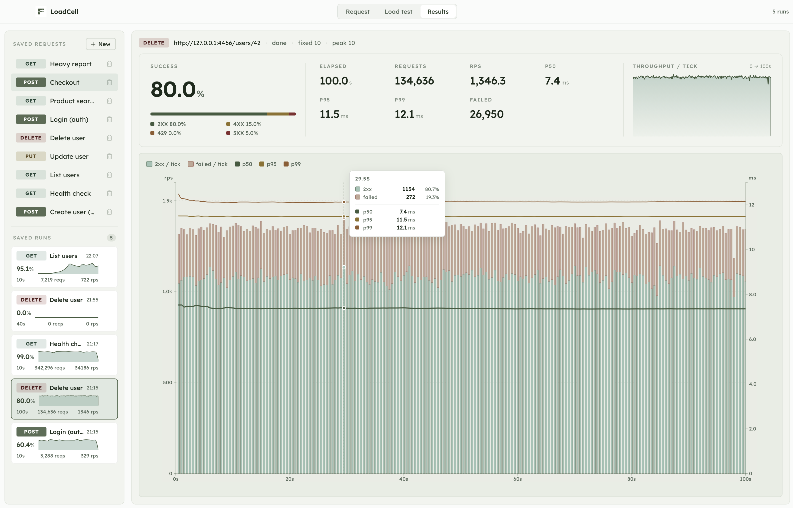

<div align="center">


# LoadCell

**HTTP load testing, on your desktop.**

A native app for hammering HTTP endpoints and watching what happens —
constant, ramp, or hand-drawn load curves with live RPS, latency
percentiles, and error breakdowns.

[](https://github.com/RobiMez/loadcell/releases/latest)
[](https://github.com/RobiMez/loadcell/releases)
[](https://github.com/RobiMez/loadcell/actions/workflows/release.yml)
[](LICENSE)
[](https://github.com/sponsors/RobiMez)

<sub>

[](https://github.com/RobiMez/loadcell/releases/latest/download/loadcell-darwin-universal.tar.gz)
[](https://github.com/RobiMez/loadcell/releases/latest/download/loadcell-windows-amd64.zip)
[](https://github.com/RobiMez/loadcell/releases/latest/download/loadcell-linux-amd64.tar.gz)

</sub>

</div>

<br/>

<p align="center">
  
</p>

---

## What it does

LoadCell is built around the actual rhythm of load testing: pick a target,
shape the load, watch it unfold, and read the result without deciphering
a wall of JSON.

- **Live metrics** — p50, p95, p99 latency, RPS, and per-status breakdowns
  (4xx / 429 / 5xx / network) updated every 100ms while the test runs.
- **Three load profiles** — constant concurrency, linear ramp, or a
  hand-drawn curve with linear, exponential, or step segments and a
  noise envelope.
- **Saved requests** — a Postman-style sidebar of HTTP requests with
  method chips, full header/body editor, and a one-click "Send" for
  smoke-testing before you load test.
- **Saved runs** — every completed run is snapshotted to disk with its
  config + history, so you can flip between past tests and watch the
  chart re-hydrate.
- **JSON in / JSON out** — request and response bodies get pretty-printed
  + syntax highlighted; copy buttons on the response body and each
  header value.
- **Native, not a CLI** — desktop window with a real chart, not 200 lines
  of terminal scroll. Built with Wails, Svelte, and D3.
- **Local only** — runs, requests, and settings all live under
  `~/Library/Application Support/loadcell/` (or the OS equivalent).
  Nothing leaves your machine.

---

## Download

Grab a prebuilt binary for your OS:

| Platform | Asset | Notes |
|---|---|---|
| macOS · universal | [`loadcell-darwin-universal.tar.gz`](https://github.com/RobiMez/loadcell/releases/latest/download/loadcell-darwin-universal.tar.gz) | Apple Silicon + Intel |
| Windows · amd64 | [`loadcell-windows-amd64.zip`](https://github.com/RobiMez/loadcell/releases/latest/download/loadcell-windows-amd64.zip) | Standalone `.exe` |
| Linux · amd64 | [`loadcell-linux-amd64.tar.gz`](https://github.com/RobiMez/loadcell/releases/latest/download/loadcell-linux-amd64.tar.gz) | Built on Ubuntu 22.04 (GLIBC 2.35) |

All releases live at [github.com/RobiMez/loadcell/releases](https://github.com/RobiMez/loadcell/releases).

### macOS Gatekeeper

The binary isn't notarized yet, so the first launch shows
*"cannot be opened because the developer cannot be verified."* Either:

```bash
# Right-click → Open works too, but this is one command:
xattr -dr com.apple.quarantine /Applications/loadcell.app
```

Or right-click `loadcell.app` → **Open** → confirm in the dialog. After the
first launch, macOS remembers your choice.

---

## Build from source

Three commands. Requires [Go 1.22+](https://go.dev), [Node 20+](https://nodejs.org),
and the [Wails CLI](https://wails.io).

```bash
# 1. Install the Wails CLI
go install github.com/wailsapp/wails/v2/cmd/wails@v2.12.0

# 2. Clone & enter the repo
git clone https://github.com/RobiMez/loadcell.git
cd loadcell

# 3. Run in dev mode...
wails dev

# ...or build a redistributable
wails build
```

On Linux you'll also need GTK/WebKit headers:

```bash
sudo apt install libgtk-3-dev libwebkit2gtk-4.0-dev build-essential pkg-config
```

---

## Project layout

```
.
├── app.go                  # Wails-bound surface (StartTest, ListRuns, SendSample…)
├── engine/
│   └── engine.go           # The load-test engine — worker pool, scheduler, aggregator
├── runs.go                 # Run persistence (JSON under UserConfigDir)
├── requests.go             # Saved-request CRUD
├── sample.go               # Single-shot "Send" handler
├── frontend/
│   ├── src/App.svelte      # Everything UI (curve editor, chart, sidebar, info sheet)
│   └── wailsjs/            # Auto-generated TS bindings to the Go side
├── tools/
│   └── echo-server/        # Tiny Express target with verb-varied error mixes
├── site/                   # Landing page (GitHub Pages)
├── build/                  # App icons + Wails build artefacts
└── .github/workflows/      # Release + Pages CI
```

The Go engine and the Svelte UI talk over Wails' generated bindings
plus a single `metrics` event for the live tick. Everything else
(saved requests, saved runs, sample responses) is request/response.

---

## Try the bundled test server

There's a small Express server in `tools/echo-server/` with nine routes
that return distinctly different status mixes and latency profiles —
perfect for seeing what each chart shape looks like.

```bash
cd tools/echo-server
node server.js
# echo-server listening on http://127.0.0.1:4466
```

Then point LoadCell at any of:

| Route | Profile |
|---|---|
| `GET /health` | 99% 2xx, fast (1–3 ms) |
| `GET /users` | 95% 2xx, occasional 5xx, modest tail |
| `POST /users` | 70% 2xx, 20% 422, 10% 5xx (validation-heavy) |
| `POST /login` | 60% 2xx, 35% 401, 5% 429 (auth-heavy) |
| `GET /products/search` | 90% 2xx, 8% 429, slow tail to 300 ms |
| `POST /checkout` | 50% 2xx, 30% 402, 15% 5xx, 5% 429 (messy) |
| `GET /reports/heavy` | 95% 2xx but 200–500 ms baseline |
| … | …and more in [`tools/echo-server/server.js`](tools/echo-server/server.js) |

---

## License

[GPL-3.0](LICENSE) — same spirit as the tools LoadCell is meant to keep
honest. Fork it, modify it, ship it — just keep it open.

---

## Sponsor / built by

LoadCell is free, open source, and built by [Robi](https://robi.work) in
between a couple day jobs. If it saves you time, a small sponsorship
helps fund more Claude tokens & food (in that order):

[](https://github.com/sponsors/RobiMez)

---


